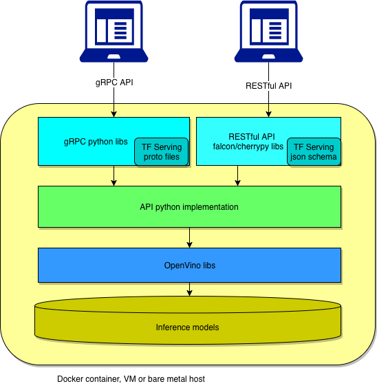

# Architecture concept

OpenVINO&trade; model server is a python implementation of gRPC API interfaces defined by Tensorflow serving.
In the backend it is using Inference Engine libraries from OpenVINO&trade; toolkit which greatly speeds up the execution on CPU,
and enables it on FPGA and Movidius devices. 

gRPC code skeleton is created based on proto buffer API definition and generated by protoc tool. 
In line with the API definition, data serialization is implemented using Tensorflow libraries. 
Request handling is then implemented via set of python classes managing AI models in Intermediate Representation 
format and Inference Engine component which executes the graphs operations.

OpenVINO&trade; model server requires the models to be present in the local file system. 
They should be mounted or copied from external storage. 

OpenVINO&trade; model server can be hosted on a bare metal server, virtual machine or inside a docker container. 
It is also suitable for landing in Kubernetes environment. 

The only exposed network interface is gRPC API which currently does not include authorization, authentication or data encryption. 
Those functions are expected to be implemented outside of the model server (for example via kubernetes ingress or nginx forwarding proxy).
Alternatively they could be added to gRPC interface inside the OpenVINO&trade; model server but for now this is out of scope.
