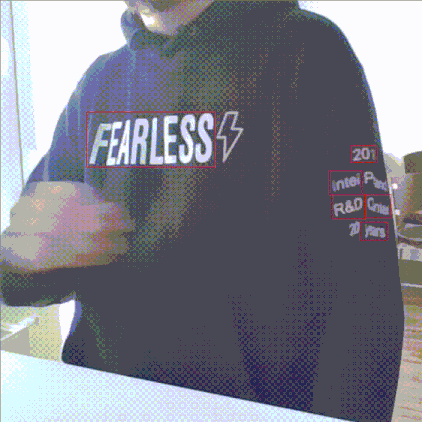

# Processing frames from camera

## Horizontal text detection in real-time
This demo presents a use case with a client written in python which captures camera frames and performs text spotting analysis via gRPC requests to OVMS. The client visualizes the results as a boxes depicted on the original image frames using OpenCV in real-time.
The client can work efficiently also over slow internet connection with long latency thanks to image data compression and parallel execution for multiple frames.



### Download model from OpenVINO Model Zoo

```bash
curl -L --create-dir https://storage.openvinotoolkit.org/repositories/open_model_zoo/2021.4/models_bin/3/horizontal-text-detection-0001/FP32/horizontal-text-detection-0001.bin -o horizontal-text-detection/1/model.bin https://storage.openvinotoolkit.org/repositories/open_model_zoo/2021.4/models_bin/3/horizontal-text-detection-0001/FP32/horizontal-text-detection-0001.xml -o horizontal-text-detection/1/model.xml
```

```bash
tree horizontal-text-detection/
horizontal-text-detection
└── 1
    ├── model.bin
    └── model.xml
```

### Start the OVMS container:
```bash
docker run -d -u $(id -u):$(id -g) -v $(pwd)/horizontal-text-detection:/model -p 9001:9001 openvino/model_server:latest \
--model_path /model --model_name horizontal-text-detection --port 9001 --layout NHWC
```

### Run the client
In the context of [example_client](../example_client) directory, run the following commands.

Install python libraries:
```bash
pip3 install -r client_requirements.txt
```

Start the client
```bash
python3 camera_client.py --grpc_address [hostname] --grpc_port 9001

Initializing requesting thread index: 0
Initializing requesting thread index: 1
Initializing requesting thread index: 2
Initializing requesting thread index: 3
Launching requesting thread index: 0
Launching requesting thread index: 1
Launching requesting thread index: 2
Launching requesting thread index: 3
ThreadID:   0; Current FPS:    31.25; Average FPS:    25.64; Average latency:   140.98ms
ThreadID:   1; Current FPS:    31.23; Average FPS:    25.67; Average latency:   136.36ms
ThreadID:   2; Current FPS:    29.41; Average FPS:    25.70; Average latency:   130.88ms
ThreadID:   3; Current FPS:    30.30; Average FPS:    25.73; Average latency:   135.65ms
...
```

You can also change the camera ID:
```
python3 camera_client.py --grpc_address [hostname] --grpc_port 9001 --video_source 0
```
Or choose to work with video file as well:
```
python3 camera_client.py --grpc_address [hostname] --grpc_port 9001 --video_source ~/video.mp4
```

> **NOTE**: Video source is cropped to 704x704 resolution to match model input size.
